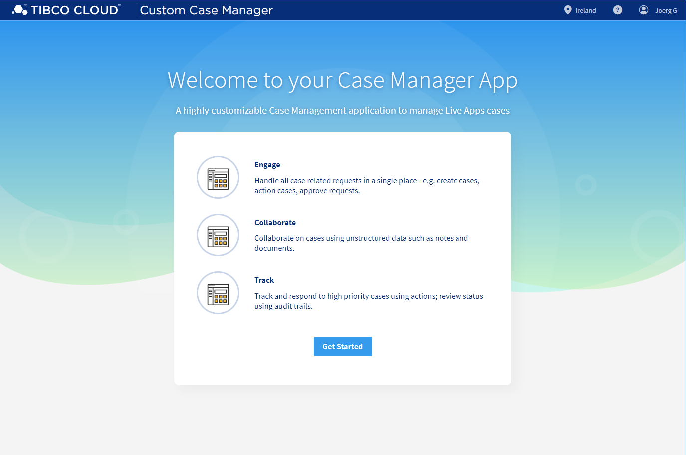

### TIBCO Cloud™ Starters Toolkit - TCSTKSPOTFIRETEMPLATE App
TIBCO Cloud™ TCSTKSPOTFIRETEMPLATE App, containing all core and essentials to create your own cloud starter.

**Splash Screen**

Welcome and Application Overview, fully use case specific adjustable.

### Videos 
a quick first video, to get an impression.

<iframe width="560" height="315" src="https://www.youtube.com/embed/x9qW8HhH-mM" frameborder="0" allow="accelerometer; autoplay; encrypted-media; gyroscope; picture-in-picture" allowfullscreen></iframe>

Link: [YouTube](https://youtu.be/x9qW8HhH-mM) ~2 min

### Help / How to 
#### Get Started 
some quicks way to get started

- [Getting Started](docs/tutorials/001-Get-your-ClientID.md)
- [Configure](docs/tutorials/002-Configure.md)

#### Configure 
how to configure the App

- [UI App ID](src/assets/config/uiAppId.md)
- [general App Configuration](src/assets/config/generalAppConfig.md) 
- [configuration Menu Configuration](src/assets/config/configurationMenuConfig.md)
- [route Access Control](src/assets/config/routeAccessControl.md)
- [Custom Forms](src/assets/config/customForms.md) 

> All Configuration JSON Files can be found in "src/assets/config".

#### Basic Developer
dome basic Developer focused Details 

- [Basic Developer Use Cases](docs/tutorials/003-Basic-Developer.md)

#### Deploy 
how to deploy the App

- [Deploy Usecase](docs/tutorials/004-Deployment.md)

#### Advanced Developer
more advanced Details

- [Advanced Developer Use Cases](docs/tutorials/005-Advanced-Developer.md)

## License
Copyright © 2019. TIBCO Software Inc.
This file is subject to the license terms contained
in the license file that is distributed with this file.

Please see 'tpc.txt' for details of license and dependent third party components referenced by this library.
