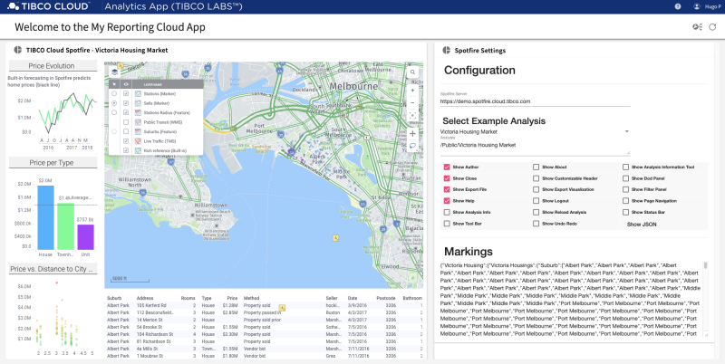

### Starters Toolkit for TIBCO Cloud™ - Analytics App
TCSTK Pattern - Analytics App, is a sample that just connects TIBCO Cloud™ Spotfire.

The Pattern application **Analytics App**, contains the essentials to open a Spotfire Dashbord and take action. It is based on the Spotfire Implemenation stored here, and known as [Spotfire Wrapper](https://github.com/TIBCOSoftware/spotfire-wrapper).

**Note** 
This Pattern App is using some Services Offerings of the TIBCO Cloud™ LiveApps Subscription, e.g. Shared State to store Application Configurations.
Also if the App should be hosted on TIBCO Cloud™, a TIBCO Cloud™ LiveApps Subscription is needed to upload the App to the Web Resource Provisioning Service.

# License
Copyright © 2020. TIBCO Software Inc. 
This file is subject to the license terms contained in the license file that is distributed with this file.

Please see tpc.txt for details of license and dependent third party components referenced by this library.
